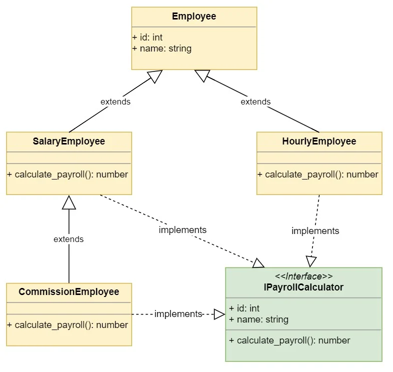

# tech201_oop2

## What is OOP in Python

Object-Oriented Programming (OOP) is a programming paradigm based on the concept of "objects", which can contain data and code that operates on the data. In Python, OOP concepts are implemented through classes and objects. Classes define the blueprint for objects and objects are instances of classes. OOP provides a way to structure code for better organization, reusability and abstraction.

#### The four pillars of Object-Oriented Programming (OOP) in Python are:

- Encapsulation: The idea of bundling data and methods that operate on that data within a single unit, or object. This is achieved in Python by creating classes, which define the blueprint for objects.

`class Car:
    def __init__(self, make, model, year, color):
        self.__make = make
        self.__model = model
        self.__year = year`

 `def get_make(self):`
       ` return self.__make`
    
    def get_model(self):
        return self.__model
    
    def get_year(self):
        return self.__year`

`my_car = Car("Toyota", "Camry", 2020, "Black")
print(my_car.get_make())  # Output: Toyota
print(my_car.get_model())  # Output: Camry
print(my_car.get_year())  # Output: 2020`

In the above example car is the class and the methods are the make, model and year.
Also and added benefit here is that the double underscore will the properties private so it can't be accessed by anyone from outside the class.

- Abstraction: The process of hiding the implementation details from the user, and only exposing the necessary information. This is achieved in Python by defining methods in the class that provide a high-level interface to the object's behavior, and by using access modifiers (such as private and protected) to control the visibility of the object's properties and methods.

- Inheritance: The mechanism by which new classes can be derived from existing classes, inheriting their properties and methods. This allows for a hierarchy of classes, where subclasses can be created to add or modify the behavior of the base class.

- Polymorphism: The ability of an object to take on many forms. In Python, this can be achieved through method overriding and method overloading, allowing objects of different classes to be treated in a similar manner, and for the same method name to be used for different implementations.

### Benefits of using OOP:

- Modularity: OOP allows you to break down complex problems into smaller, more manageable parts (objects), which can be separately tested and reused as needed.

- Abstraction: OOP provides a way to hide implementation details and provide a higher-level interface to the objects, making it easier to understand and use the code.

- Inheritance: OOP provides a way to create new classes based on existing classes, inheriting their properties and methods. This makes it easier to create and maintain similar objects with similar behavior.

- Polymorphism: OOP allows objects of different classes to be treated in a similar manner, and for the same method name to be used for different implementations. This makes the code more flexible and reusable.

- Code reuse: OOP allows you to reuse code through inheritance and encapsulation, reducing the amount of time and effort required to develop new applications.

- Improved security: OOP allows you to control the visibility of object properties and methods, providing a way to ensure that sensitive data is not directly accessible from outside the object, making the code more secure.

Overall, OOP provides a way to structure and organize your code in a clear and modular manner, making it easier to develop, maintain, and scale complex applications.

### What are lambda functions:

Lambda functions are small, anonymous functions in Python. They are used to perform simple operations, and can be defined in a single line of code.

Here we have an example

`lambda arguments: expression

The arguments are passed to the function on the left-hand side of the colon, and the expression on the right-hand side is the return value of the function.

Furthermore Lambda functions can be useful in several instances in Python.

1.Callbacks: Lambda functions can be used as callbacks in event-driven programming, such as when creating buttons or menu items in GUI applications.

2.Map and Filter functions: The map and filter functions in Python can be used to apply a lambda function to a list or other iterable data structure. This allows you to perform operations such as filtering or transforming the elements of a list in a concise and readable manner.

3.Reduce function: The reduce function in the functools module can be used to apply a binary operation to the elements of a list, reducing them to a single value. A lambda function can be used to define the binary operation.

4.List comprehensions: Lambda functions can be used in list comprehensions, allowing you to perform operations such as filtering or transforming the elements of a list in a compact and readable manner.

5.Higher-order functions: Lambda functions can be used as arguments to higher-order functions, allowing you to pass functions as arguments and return functions as results. This can make your code more flexible and reusable.

6.Custom sorting: Lambda functions can be used as the key argument to the sorted function, allowing you to sort lists and other iterable data structures based on custom criteria.

7.Simple operations: Lambda functions can be used to perform simple operations, such as adding or multiplying two values, or computing the length of a string. This can make your code more concise and readable.

Lambda functions are a powerful and flexible feature of Python, and can be used in many different ways to make your code more concise and readable.
`